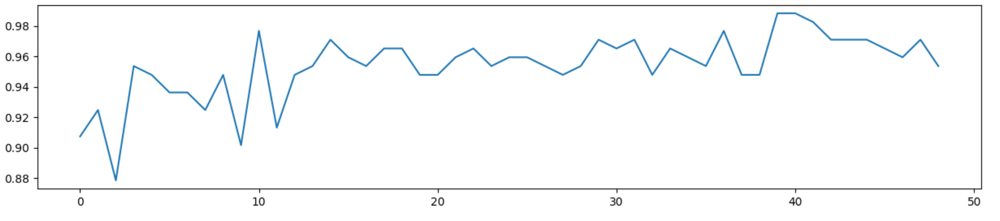

# 📺 Video Classification

Different approaches to video classification on [Youtube Videos Dataset](https://www.kaggle.com/datasets/rajatrc1705/youtube-videos-dataset) using [CLIP](https://openai.com/blog/clip/) embeddings for frames.

## Structure
* [`datasets`](./datasets) ‒ implementations of torch datasets (to get video embeddings based on multiple frames, to get a random video frame).
* [`models`](./models) ‒ models implementations.
* [`scripts`](./scripts) ‒ scripts for preparing data to training and evaluation.
* [`video_classification_utils`](./video_classification_utils) ‒ various useful utilities, e.g. for obtaining frames from video, for training models.
* [`experiments.ipynb`](./experiments.ipynb) ‒ notebook with running experiments, plots and metrics
## Requirements

Create virtual environment with `venv` or `conda` and install requirements:

```shell
pip install -r requirements.txt
```

Or build and run docker container:
```shell
./run_docker.sh
```

## Data

The [Youtube Videos Dataset](https://www.kaggle.com/datasets/rajatrc1705/youtube-videos-dataset) was used for training and testing.
The dataset contains information about the video and its subject matter. Our task involves classifying videos by subject using frame embeddings.

There are 4 video categories in total: _food_, _art_music_, _travel_, _history_.

#### Prepare embeddings
Videos were downloaded using the script [`prepare_embeddings.py`](./scripts/prepare_embeddings.py).
Since the dataset contains videos that have already been deleted, only those videos for which there is a valid link were downloaded.

A total of _1728_ videos were downloaded. 
* travel: 602
* food: 491
* art_music: 317
* history: 316

As the script name suggests, the script also extracts embeddings from videos.


The script extracts `--frames-count` (script parameter) frames from each video. Frames are extracted evenly, that is, the distance between all frames is the same.
Further, for each frame, the embedding vector is extracted using the [CLIP](https://github.com/openai/CLIP) model (ViT-B/32). The embedding sequence is saved to a json file in the directory `--save-embeddings-to`.

For further experiments, _100_ frames were extracted from each video.

#### Split into train test

Splitting into training and test sets is done using a script [`split_into_train_test.py`](./scripts/split_into_train_test.py). The share of the test sample from the total dataset is controlled by a parameter `--test-size` (default: _0.1_).

The split data statistics are as follows:

* Train (_1553_):
  * travel: 540
  * food: 442
  * history: 286
  * art_music: 285
* Test (_173_):
  * travel: 62
  * food: 49
  * art_music: 32
  * history: 30

## Models
Ideas for models are taken from the article [CLIP4Clip](https://arxiv.org/abs/2104.08860).
The classic way of training a model is compared to training with [Mixup](https://arxiv.org/abs/1710.09412).

### Linear classifier


The video vector is obtained by averaging the vectors for the frames. This vector is converted to logits by a linear layer.

#### Mixup


In this case, the mixup does not add images, but video embeddings.

$$\lambda \cdot embedding_1 + (1 - \lambda) \cdot embedding_2 = embedding$$

Ground truth one-hot vectors are added with the same coefficients:

$$\lambda \cdot target_1 + (1 - \lambda) \cdot target_2 = target$$

```python
for batch in zip(train_data_loader1, train_data_loader2):
    optimizer.zero_grad()

    lam = np.random.beta(alpha, alpha)
    batch1, batch2 = batch
    batch = {
        "embeddings": lam * batch1["embeddings"]
        + (1 - lam) * batch2["embeddings"],
        "labels": lam * batch1["labels"] + (1 - lam) * batch2["labels"],
    }
```

### Transformer Encoder


In this approach, positional embeddings are added to frame embeddings. The resulting vectors are converted by one transformer encoder layer. The outputs are averaged and converted to logits using a linear layer.

An attention mask is also fed into the transformer encoder, as the model is trained by mini-batch gradient descent.

#### Mixup


When using the mixup technique, the frame embedding matrices are added element by element.

```python
for batch in zip(train_data_loader1, train_data_loader2):
    optimizer.zero_grad()

    lam = np.random.beta(alpha, alpha)
    batch1, batch2 = batch
    batch = {
        "embeddings": lam * batch1["embeddings"]
            + (1 - lam) * batch2["embeddings"],
        "labels": lam * batch1["labels"] + (1 - lam) * batch2["labels"],
        "attention_mask": torch.logical_or(
            batch1["attention_mask"].bool(),
            batch2["attention_mask"].bool()
        ).float()
    }
```

### Classification based on one random frame


A random frame is extracted from the video, preprocessed and converted into an embedding vector using the СLIP model (ViT-B/32).
Embedding is converted to logits with one linear layer. 

A random frame for each video is fixed and determined by the hash function of the video id:

```
frame_index = hash(video_id) % total_frame_count
```

#### Mixup


This approach uses a classic mixup, in which the original images are mixed.

```python
for batch in zip(train_data_loader1, train_data_loader2):
    optimizer.zero_grad()

    lam = np.random.beta(alpha, alpha)
    (images1, labels1), (images2, labels2) = batch
    images = lam * images1 + (1 - lam) * images2
    labels = lam * labels1 + (1 - lam) * labels2
```

## Results
The value of the metric **f1 micro** is presented. Training was carried out on _10_ epochs.

* Linear with mixup
  
* Linear w/o mixup
  
* Transformer Encoder with mixup
  
* Transformer Encoder w/o mixup
  
* Random frame with mixup
  
* Random frame w/o mixup
  


As you can see from the metrics, mixup improves quality in two out of three cases. Also, an interesting fact is that the classification of video topics by a random frame gives, although less compared to other approaches, but still good quality.


